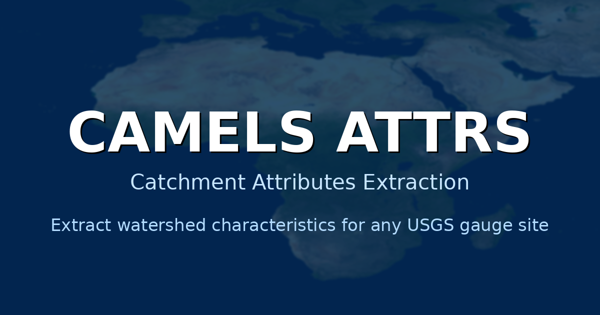

# CAMELS Attrs



A Python package for extracting CAMELS-like catchment attributes for any USGS gauge site in the United States.

## Overview

This package provides a simple, reproducible way to extract comprehensive catchment attributes following the CAMELS (Catchment Attributes and Meteorology for Large-sample Studies) methodology. It automates the extraction of topographic, climatic, soil, vegetation, geological, and hydrological characteristics for any USGS-monitored watershed.

**Author:** Mohammad Galib (mgalib@purdue.edu)  
**Affiliation:** Lyles School of Civil Engineering, Purdue University  
**Reference Work:** Based on the methodology described in the FAIR Science in Water Resources tutorial series

## Features

- **Watershed Delineation**: Automated watershed boundary extraction using NLDI
- **Topographic Attributes**: Elevation, slope, and drainage area from 3DEP DEM
- **Climate Indices**: Precipitation, temperature, aridity, seasonality from GridMET
- **Soil Characteristics**: Texture, porosity, conductivity from gNATSGO and POLARIS
- **Vegetation Metrics**: LAI, NDVI/GVF, land cover from MODIS and NLCD
- **Geological Properties**: Lithology and permeability from GLiM and GLHYMPS
- **Hydrological Signatures**: Flow statistics, baseflow index, event characteristics

## Installation

```bash
pip install camels-attrs
```

Or install from source:

```bash
git clone https://github.com/galib9690/camels-attrs.git
cd camels-attrs
pip install -e .
```

### Optional Dependencies

For geological attribute extraction (GLiM, GLHYMPS), you may need to install `pygeoglim` separately if it's not available on PyPI:

```bash
pip install git+https://github.com/hyriver/pygeoglim.git
```

If `pygeoglim` is not installed, the package will still work but will return default values for geological attributes.

## Quick Start

### Python API

```python
from camels_attributes import CamelsExtractor

# Extract attributes for a single gauge
extractor = CamelsExtractor('01031500')  # USGS gauge ID
attributes = extractor.extract_all()

# Save to CSV
extractor.save('attributes.csv')

# Or get as DataFrame
df = extractor.to_dataframe()
```

### Command Line Interface

```bash
# Single gauge
camels-extract 01031500 -o attributes.csv

# Multiple gauges
camels-extract 01031500 02177000 06803530 -o combined.csv

# Custom date ranges
camels-extract 01031500 --climate-start 2010-01-01 --climate-end 2020-12-31

# JSON output
camels-extract 01031500 -o attributes.json -f json
```

## Extracted Attributes

The package extracts 70+ attributes organized into categories:

### Metadata
- `gauge_id`, `gauge_name`, `gauge_lat`, `gauge_lon`, `huc_02`

### Topography
- `elev_mean`, `elev_min`, `elev_max`, `elev_std`
- `slope_mean`, `slope_std`
- `area_geospa_fabric`

### Climate (customizable date range)
- `p_mean`, `pet_mean`, `temp_mean`
- `aridity`, `p_seasonality`, `temp_seasonality`
- `frac_snow`
- `high_prec_freq`, `high_prec_dur`, `high_prec_timing`
- `low_prec_freq`, `low_prec_dur`, `low_prec_timing`

### Soil
- `soil_porosity`, `soil_depth_statsgo`, `max_water_content`
- `sand_frac`, `silt_frac`, `clay_frac`
- `soil_conductivity`

### Vegetation
- `lai_max`, `lai_min`, `lai_diff`
- `gvf_max`, `gvf_diff`, `gvf_mean`
- `frac_forest`, `frac_cropland`, `water_frac`
- `dom_land_cover`, `dom_land_cover_frac`
- `root_depth_50`, `root_depth_99`

### Geology
- `geol_1st_class`, `geol_2nd_class`
- `glim_1st_class_frac`, `glim_2nd_class_frac`
- `carbonate_rocks_frac`
- `geol_permeability`, `geol_porostiy`

### Hydrology (customizable date range)
- `q_mean`, `q_std`, `q5`, `q95`, `q_median`
- `baseflow_index`, `runoff_ratio`, `stream_elas`
- `slope_fdc`, `flow_variability`
- `high_q_freq`, `high_q_dur`
- `low_q_freq`, `low_q_dur`
- `zero_q_freq`
- `hfd_mean`, `half_flow_date_std`

## Requirements

- Python >=3.8
- numpy, pandas, geopandas
- xarray, rioxarray, rasterio
- pynhd, py3dep, pygridmet, pygeohydro
- pygeoglim, planetary-computer
- scipy, matplotlib

See `pyproject.toml` for complete dependency list.

## Data Sources

- **Watershed boundaries**: USGS NLDI
- **Topography**: USGS 3DEP
- **Climate**: GridMET
- **Soil**: gNATSGO, POLARIS
- **Vegetation**: MODIS (LAI, NDVI), NLCD
- **Geology**: GLiM, GLHYMPS
- **Streamflow**: USGS NWIS

## References

This package implements the methodology described in:

- Newman et al. (2015). Development of a large-sample watershed-scale hydrometeorological dataset. NCAR Technical Note
- Addor et al. (2017). The CAMELS data set: catchment attributes and meteorology for large-sample studies. Hydrology and Earth System Sciences

## Contributing

Contributions are welcome! Please feel free to submit a Pull Request.

## License

MIT License - see LICENSE file for details.

## Citation

If you use this package in your research, please cite:

```
Galib, M. & Merwade, V. (2025). camels-attrs: A Python package for extracting 
CAMELS-like catchment attributes. Lyles School of Civil Engineering, Purdue University.
```

## Contact

Mohammad Galib - mgalib@purdue.edu  
Venkatesh Merwade - vmerwade@purdue.edu

## Acknowledgments

This work is part of the FAIR Science in Water Resources initiative at Purdue University.
